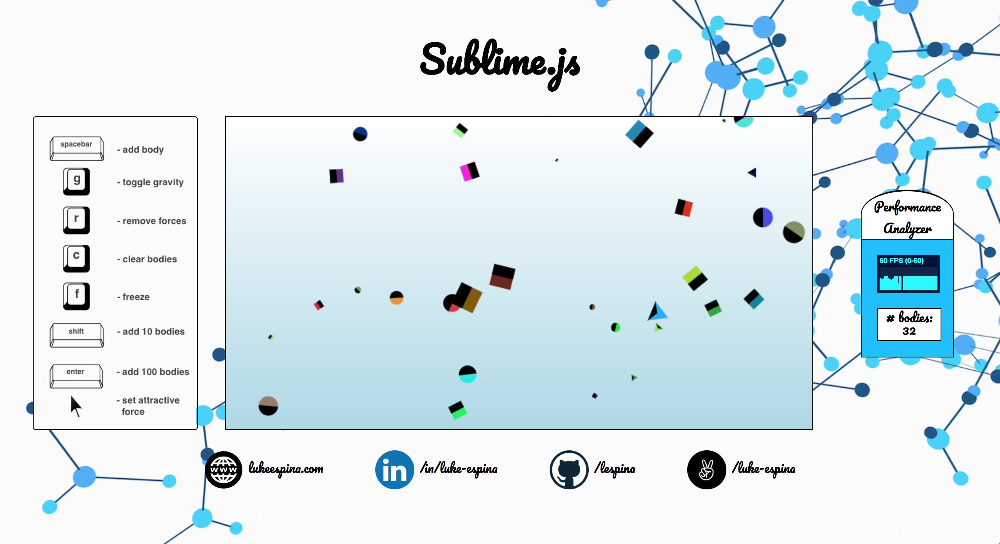
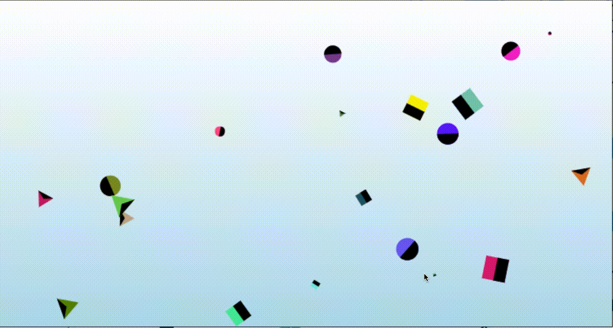
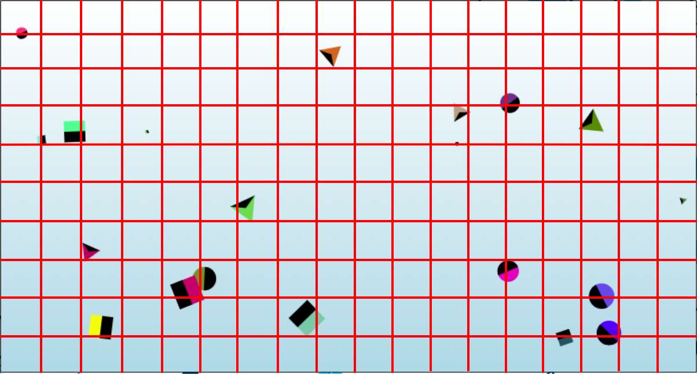
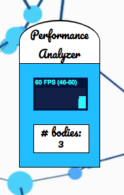
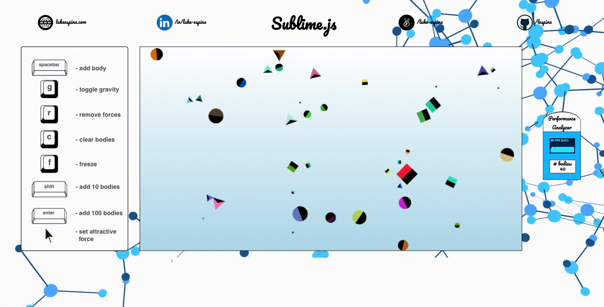

# Sublime README

[Sublime.js](http://www.lukeespina.com/sublime) a performant HTML5 canvas-based physics engine implemented in pure JavaScript with minimal external library support that can easily handle hundreds of interacting bodies.



### Circles, Squares, Triangles, Galore!
Sublime implements several types of moveable shapes that all inherit from a base Body class: [Circle, Square, Triangle].  



Collisions are precise to the specific boundaries of a given body, and may occur when shapes come into contact with one another.

### Smart, Grid-Based Collision Detection
Sublime implements a smart grid-based collision-detection algorithm for fast performance even when tracking **hundreds** of moving bodies!


When lots of shapes come out to play, things get pretty wild.

##### A Brief Detour: Collision Checking

In order to check if two objects need to collide in a given animation frame, Sublime implements a few key methods:

##### Body#asLines()
Every child body class (i.e. Circle, Square, Triangle) implements its own asLines method specific to that class that returns an array of Line objects defining the current coordinate boundaries of that shape.  Circles are approximated as octogons by default.

```javascript
class Square extends Body {
  ...
  asLines() {
    const size = this.sideSize;
    const [x, y] = this.pos.toArr();

    const topLeft = [x - size / 2, y - size / 2];
    const topRight = [x + size / 2, y - size / 2];
    const bottomLeft = [x - size / 2, y + size / 2];
    const bottomRight = [x + size / 2, y + size / 2];

    return [
      new Line(topLeft, topRight).rotate({x, y}, this.orientation),
      new Line(topRight, bottomRight).rotate({x, y}, this.orientation),
      new Line(bottomRight, bottomLeft).rotate({x, y}, this.orientation),
      new Line(bottomLeft, topLeft).rotate({x, y}, this.orientation)
    ];
  }
  ...
}
```

Given this functionality, we can then define a collision as any frame where any of the lines of one body intersect with any of the lines of any other body, like so:

##### Body#intersectsWith(otherBody)

```javascript
class Body {
  ...
  intersectsWith(otherBody) {
    const thisLines = this.asLines();
    const otherLines = otherBody.asLines();
    for (let i=0; i<thisLines.length; i++) {
      for (let j=0; j<otherLines.length; j++) {
        if (thisLines[i].intersectsWith(otherLines[j])) {
          return otherLines[j];
        }
      }
    }
    return false;
  }
  ...
}
```
<sup>N.B. line-intersection package is used to check of a line intersects with another line</sup>

##### Aside: A word on the naive approach (not used)

In the initial naive implementation of collision detection, we simply checked every body against every other body on the map.  This resulted in a rather slow, limited final product that began to slow noticeably at just 50 on-screen bodies.  Following deep contemplation, we realized the errors of our ways, and rewrote the collision-checking algorithm to utilize an internal grid avoid checking collisions between objects far apart on the canvas.

##### Finally, the grid-based scheme!

Upon initialization, Sublime creates a 2-dimensional grid object, where each grid space occupies a square whose side-length is equal to the maximum possible length of any generated body on the canvas.

Internally, the Sublime.js keeps all constituent bodies stored this object, grouping together bodies by the grid space that bounds their center position on the canvas.



With our handy grid, we now iterate over all bodies at each frame and check if each body intersects only with those objects that fall within a 1-grid-space radius of its own grid position!  Since we defined the size of grid spaces as equal to the maximum possible length of a body on the canvas, no body may possibly collide with another body that is more than 1 space apart from itself on the grid.

Following the implementation of this algorithm, we were suddenly able to maintain performance while rendering hundreds of objects and interactions on-screen.

#### Performance Analyzer
Sublime provides a convenient frames-per-second (FPS) display on the right-hand side of the screen and bodies count to show sublime's performance capabilities clearly!



#### Responsive
Sublime is fully responsive with breakpoints ranging from screen-widths of 1100px - 1980px!



### Future Directions
* I am planning to build a game using the public API of this physics engine, stay tuned!
* I may go back and refactor the collision resolution algorithm to employ a discrete verlet scheme for more accurate behavior and enforcement of rigidity.
