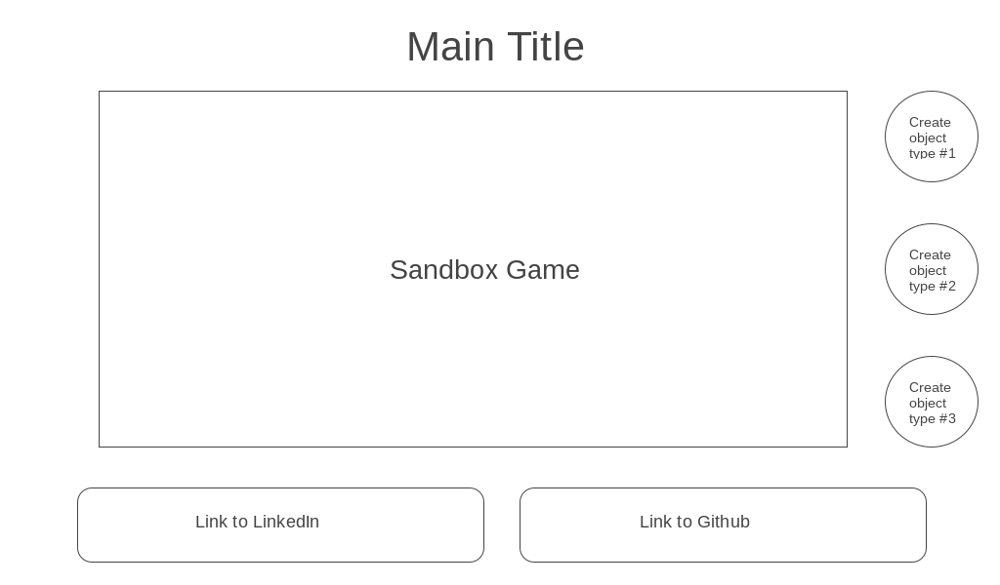

# Sublime Sandbox (not actual title)
### Summary
Sublime Sandbox is an interactive sandbox game demoing a lightweight physics engine built entirely on pure vanilla javascript and rendered with HTML5 Canvas with no external libraries.  

### Functionality & MVP

With this physics engine simulator, users will be able to:
- [ ] Reset the sandbox
- [ ] Generate objects through button presses
- [ ] Manipulate objects on screen through clicking
- [ ] Allow objects to collide
- [ ] Allow objects to rotate

### Wireframes
This app will consist of a single screen with the interactive sandbox and nav links to my Github and LinkedIn.

Game controls will include clicking to launch objects around the screen. Time permitting, the user will be able to select a few different objects to create and manipulate through a side panel of creation buttons.

### Architecture and Technologies

This project will be implemented with the following technologies:

- JavaScript for physics logic
- HTML5 Canvas for rendering
- Browserify to bundle js files

This project will involve the following scripts:

###### sandbox.js:
this script will handle the logic for creating and updating necessary Canvas objects and rendering them to the DOM

###### physics.js:
this script will handle the rules dictating how environmental changes (i.e. forces, collisions) will affect the various properites of individual bodies (ex. linear momentum, angular momentum)

###### events.js:
this script will handle the logic for mouse-click events

##### Day 1: 
Set up all necessary Node modules.  Configure browserify, make an entry file, and create skeletons for all 3 additional script files.  Learn the basics of Canvas drawing and manipulation in vanilla JavaScript. Dedicate this day to implementing your basic particle and set up the logic for a sandbox to continuous render objects according to their property of linear momentum.

##### Day 2: 
Handle collisions between objects in 2 dimensions.  
  - start with 1-dimensional case handling objects of different masses & velocities
  - generalize to 2-dimensional case
  - allow for glancing collisions
  - ensure objects may collide gracefully with the wall(s) of the sandbox

##### Day 3: 
Implement a particle generator to demonstrate 2-D collisions.  Add an 'on click' event handler that simulates an explosion at the click position on screen.  Prettify your objects and collisions with styled coloring and little flourishes, if applicable.  If time permits:
  - implement a dampening effect on momentum to encourage mouse click interaction
  - handle particles of various sizes
  - handle particles of various masses
  - create particles of different 'materials' that act intuitively (i.e. metal vs. wood)
  - create a special bouncy ball that bounces violently

##### Day 4: 
Dedicate this day to getting the project 100% presentable.  Style the frontend, put in nice looking links and an elegant main title, choose a background theme and integrate it with the rest of the page styles.  Add an audio component and choose a free piece and create a mute toggle button.  If time permits, work on bonuses.

Bonuses:
  - Generalize to rigid bodies -- not just point mass balls (ex. long sticks).  
  - Add moment of inertia & angular momentum attributes to objects and allow for rotation.  
  - Implement force fields (i.e. gravitational)
